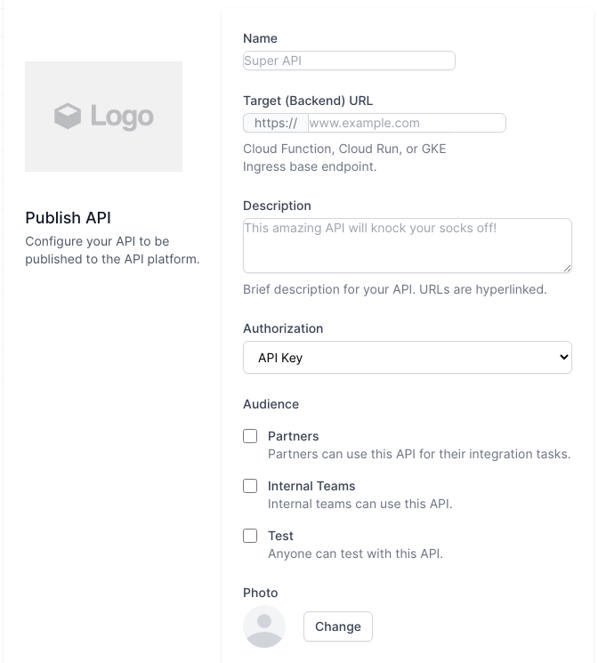

# Apigee Templater
This is a simple tool for automating the templating of Apigee API proxies through a web frontend. The generated proxy is currently downloaded, but could easily be deployed to an Apigee org and environment as needed.

A **live version** can be tested [here](https://apigee-templater-h7pi7igbcq-ew.a.run.app/).



Current features:
* Proxy name is set
* Target URL is set

Coming soon features:
* Set Auth based on config in frontend
* Throttling config

# Easy deploy
[](https://deploy.cloud.run)

If your GCP project allows unautenticated Cloud Run access, then you can just click the button above to deploy to Cloud Run and access the tool at the published URL.

# Normal deploy
Simply clone the repo and check the **deploy.sh** script to adapt to your GCP environment, or **deploy_local.sh** to build in a local Docker environment.

In the simplest case you can build and deploy to cloud run like this:

```bash
./deploy.sh
```
# Supported features
Currently only proxy name and target path are set from the frontend, but features can easily be added to support more and custom features that are templated together into the finished proxy (templating is done with handlebarsjs in the backend service).

# Feedback and feature requests
In case you find this useful feel free to request features or report bugs as Github issues.
