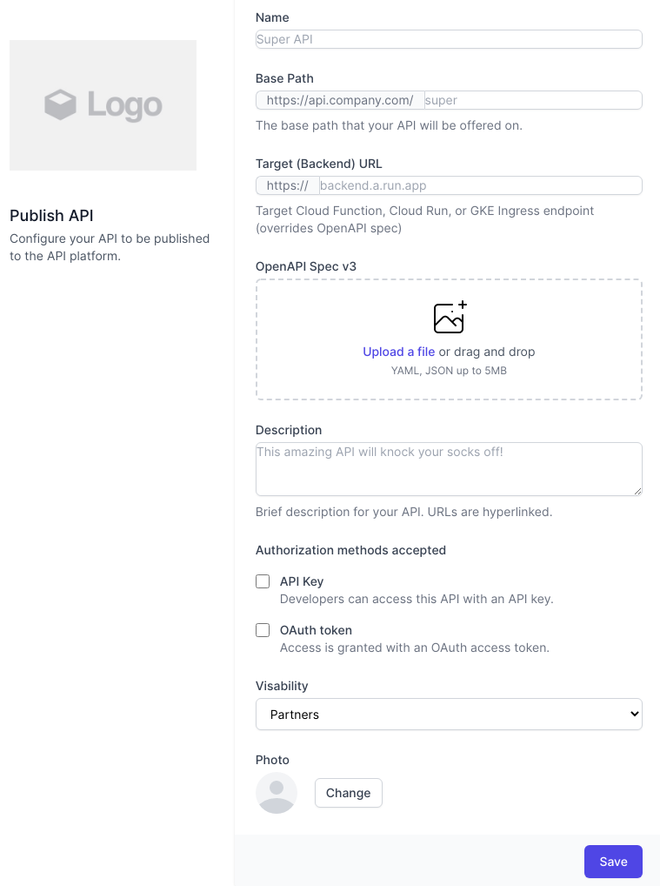

# Apigee Templater
This is a simple tool for automating the templating of Apigee API proxies through a web frontend. The generated proxy is currently downloaded, but could easily be deployed to an Apigee org and environment as needed.

A **live version** can be tested [here](https://apigee-templater-h7pi7igbcq-ew.a.run.app/). Just fill in a name, a base path, an existing endpoint, and you can submit to get a proxy bundle generated and downloaded, which you can then import into Apigee (any version).



Current features:
* Proxy name is set
* Base path is set
* Target URL is set, or if an OpenAPI spec file is supplied, the server is taken as the target URL

Coming soon features:
* Set Auth based on config (key, token, something else..)
* More template snippets around throttling, analytics, etc...

# Easy deploy
[](https://deploy.cloud.run)

If your GCP project allows unautenticated Cloud Run access, then you can just click the button above to deploy to Cloud Run and access the tool at the published URL.

# Normal deploy
Simply clone the repo and check the **deploy.sh** script for any customizations for your GCP environment, and then run:

```bash
./deploy.sh
```

As an alternative you can also run **deploy_local.sh** to build to a local Docker environment.

# Exending
The project is simple to extend because the service is built with TypeScript and an easy plugin machanism for loading any additional templating, or adapting any of the existing plugins.  Just check out **service/src/index.ts** to see how the plugins are loaded, and **service/lib/plugins** to see the existing plugins, which are easy to duplicate and extend.

# Feedback and feature requests
In case you find this useful feel free to request features or report bugs as Github issues.
